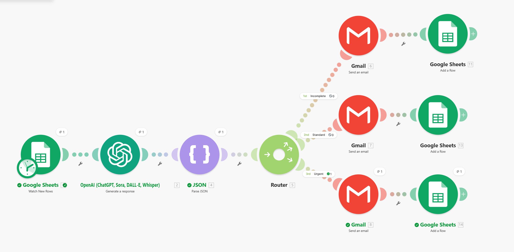
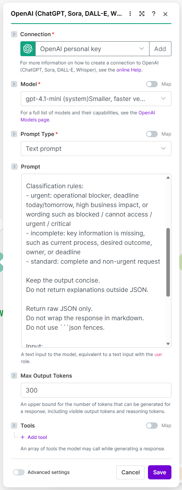
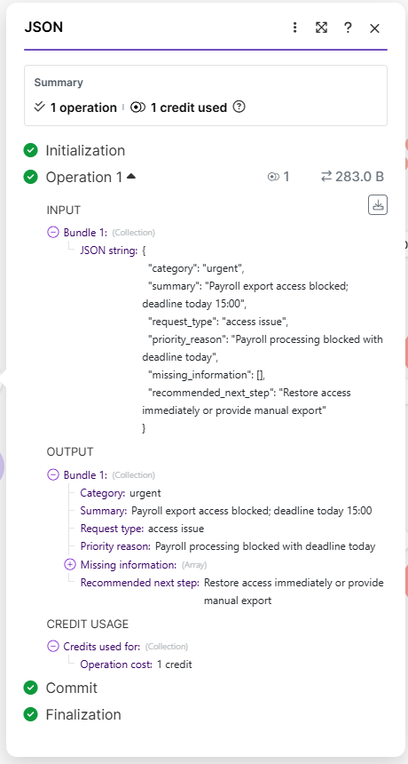
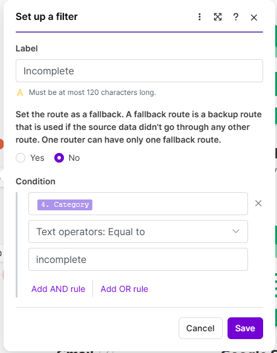
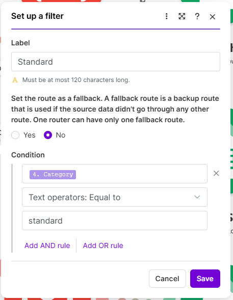
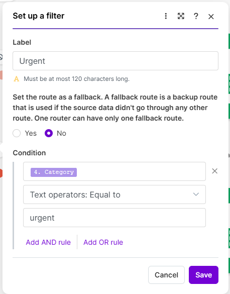
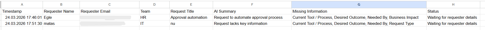
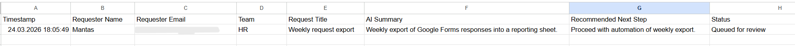
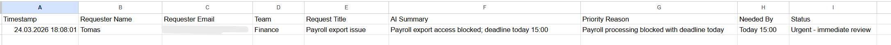

# Make Request Triage Router

Small portfolio demo showing AI-assisted request triage with branching logic in Make.

## Overview

This demo simulates a lightweight internal intake workflow for automation-related requests.

A new request is submitted through a form and stored in Google Sheets. Make then processes the new entry, sends the request to an AI classification step, parses the structured JSON output, and routes the request into one of three paths:

- urgent
- incomplete
- standard

The goal is to demonstrate practical workflow automation, structured AI output, and route-based handling in a small portfolio-ready scenario.

## Scenario

Teams often submit requests that need initial review before action:

- some are urgent and need immediate escalation
- some are incomplete and need clarification
- some are standard and can move into a normal processing queue

Instead of manually reviewing each request first, the workflow performs an initial AI-assisted triage step and routes the request accordingly.

## Workflow

1. Google Sheets -> Watch New Rows
2. OpenAI -> classify request and return structured JSON
3. JSON -> Parse JSON
4. Router -> split request into three possible routes
5. Route-specific actions:
   - urgent -> send alert email + log to urgent queue
   - incomplete -> send clarification email + log to waiting-for-info queue
   - standard -> send acknowledgement email + log to standard queue

## Input

Source: Google Form responses stored in Google Sheets

Fields used in the intake form:

- Requester Name
- Requester Email
- Team
- Request Title
- Request Description
- Current Tool / Process
- Desired Outcome
- Needed By
- Business Impact

## AI role

The AI step is used for initial triage only.

It returns structured JSON with:

- `category`
- `summary`
- `request_type`
- `priority_reason`
- `missing_information`
- `recommended_next_step`

This structured output is then parsed and used by Make router filters.

## Routing logic

### urgent
Used for requests that block work, have near-term deadlines, or indicate strong business impact.

Actions:
- send alert email
- write row to `Urgent Queue`

### incomplete
Used when key details are missing and the request cannot be properly assessed yet.

Actions:
- send clarification email
- write row to `Waiting for Info`

### standard
Used for complete but non-urgent requests.

Actions:
- send acknowledgement email
- write row to `Standard Queue`

## Example business value

This workflow helps:

- reduce manual triage effort
- separate urgent and non-urgent work earlier
- avoid processing incomplete requests too early
- improve consistency of intake handling
- produce structured outputs for later tracking

## Tools used

- Make
- Google Forms
- Google Sheets
- Gmail
- OpenAI

## Demo evidence

### 1. Full scenario overview

### 2. OpenAI classification step

### 3. Parsed JSON output

### 4. Router filters

#### Incomplete

#### Standard

#### Urgent

### 5. Example email output

### 6. Queue outputs

#### Waiting for Info

#### Standard Queue

#### Urgent Queue

## Notes

- This is a portfolio demo, not a production deployment.
- The AI step is used as a triage aid, not as a final business decision-maker.
- The workflow is intentionally small, readable, and easy to explain in recruitment conversations.
- The scenario focuses on practical routing, structured outputs, and workflow design rather than backend implementation.

## Repository contents

- `prompts/triage-prompt.txt`
- `demo-data/sample-requests.md`
- `routing/filter-logic.md`
- screenshots stored in `../docs/screenshots/make/`

## Status

Working portfolio demo with AI classification, JSON parsing, and route-based handling