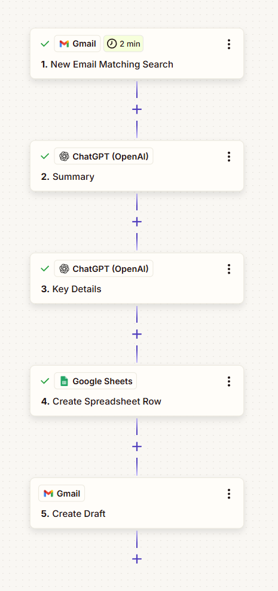
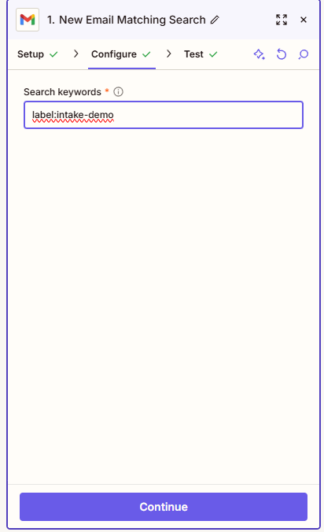
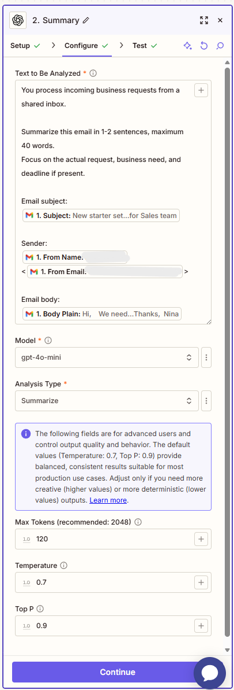
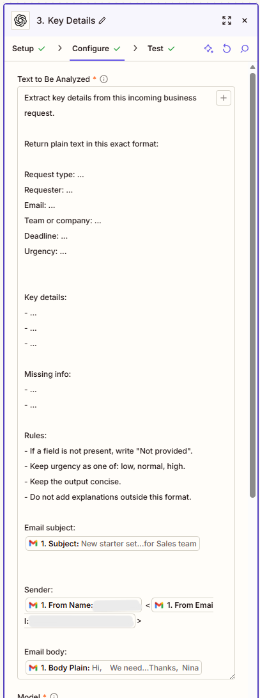
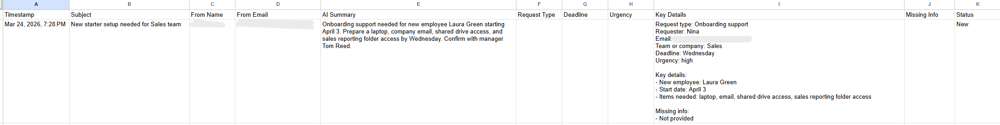
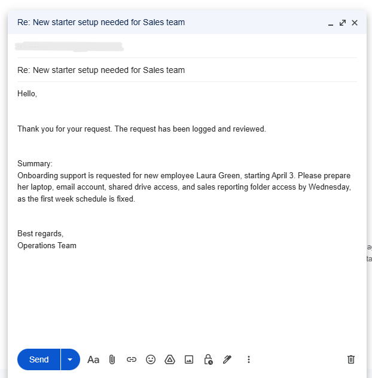

# Zapier Email Intake Assistant

Small portfolio demo showing a practical AI-assisted email intake workflow built with Zapier.

## Overview

This demo simulates a simple shared inbox intake workflow for business requests.

When a matching email appears in Gmail, the workflow:
- captures the message,
- generates a short AI summary,
- extracts key request details,
- logs the result in Google Sheets,
- creates a Gmail draft for follow-up.

The goal is to demonstrate a lightweight linear workflow with practical business value and minimal complexity.

## Scenario

A shared inbox receives incoming operational or support-related requests.  
Instead of manually reading and logging each message, the workflow performs a small AI-assisted intake step and prepares the request for further handling.

## Workflow

1. Gmail -> New Email Matching Search
2. ChatGPT (OpenAI) -> summarize the email
3. ChatGPT (OpenAI) -> extract key request details
4. Google Sheets -> create spreadsheet row
5. Gmail -> create draft reply

## Input

Source: Gmail messages matching a search query

Example search:
- `label:intake-demo`

Example request types:
- onboarding support
- access requests
- internal admin requests
- shared inbox operational requests

## AI role

The workflow uses two AI-assisted text steps:

### 1. Summary
Creates a short human-readable summary of the email.

### 2. Key details extraction
Extracts relevant request information into a structured plain-text block, including:
- request type
- requester
- email
- team or company
- deadline
- urgency
- key details
- missing info

## Output

The workflow produces:
- a short AI summary,
- an extracted key-details block,
- a row in Google Sheets intake log,
- a Gmail draft for follow-up.

## Example business value

This workflow helps:
- reduce manual intake effort for shared inboxes
- standardize the first review step
- make incoming requests easier to scan and log
- prepare a basic follow-up action without overengineering

## Tools used

- Zapier
- Gmail
- Google Sheets
- OpenAI

## Demo evidence

### 1. Zap overview

### 2. Gmail trigger

### 3. AI summary step

### 4. AI key details step

### 5. Google Sheets log output

### 6. Gmail draft output

## Notes

- This is a portfolio demo, not a production deployment.
- The workflow intentionally stays linear and small.
- The emphasis is on practical AI-assisted intake, readable outputs, and lightweight automation.
- The Google Sheets step stores message metadata, summary, and extracted details in a simple log format.

## Repository contents

- `prompts/summary-prompt.txt`
- `prompts/key-details-prompt.txt`
- `demo-data/sample-email.md`
- `mapping/google-sheets-columns.md`
- screenshots stored in `../docs/screenshots/zapier/`

## Status

Working portfolio demo with AI-assisted email intake, Google Sheets logging, and Gmail draft creation